# AWS Backup Plan for EC2 and RDS

## 📌 Project Title
**Set Up AWS Backup Plan for EC2 and RDS**

## 🎯 Objective
Configure and manage automated backup and recovery for AWS resources using **AWS Backup** by protecting:
- 1 EC2 Instance
- 1 RDS MySQL Database

---

## 🏗️ PART 1: Infrastructure Setup

### Step 1: Launch EC2 Instance
- **Name:** Backup-EC2-Server  
- **AMI:** Amazon Linux 2  
- **Instance Type:** t3.micro (Free Tier)  
- **Security Group Rules:**
  - SSH (22) – Your IP
  - HTTP (80) – Anywhere

Launch the instance.

---

### Step 2: Connect to EC2
```bash
ssh -i your-key.pem ec2-user@<EC2-Public-IP>
```

---

### Step 3: Install Web Server
```bash
sudo yum update -y
sudo yum install httpd -y
sudo systemctl start httpd
sudo systemctl enable httpd
```

---
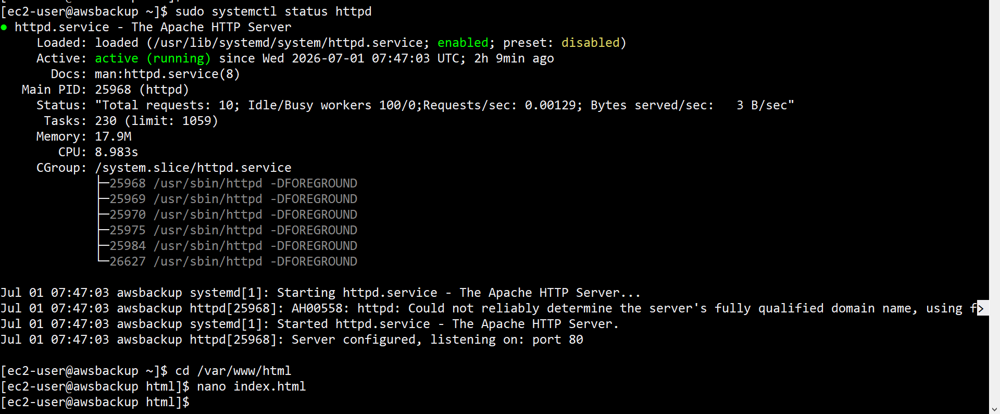
### Step 4: Create Test Data
```bash
cd /var/www/html
sudo nano index.html
```

Add:
```html
<h1>AWS Backup Project - Anuja Shinde</h1>

<h2>EC2 Backup Validation Dashboard</h2>

<p>
Welcome to the AWS Backup Validation environment.
This page demonstrates successful deployment of a responsive web application
hosted on an EC2 instance. The environment is used to validate backup,
restore, and disaster recovery operations while ensuring application
availability and data integrity.
</p>
```

Access in browser:
```
http://<EC2-Public-IP>
```

---
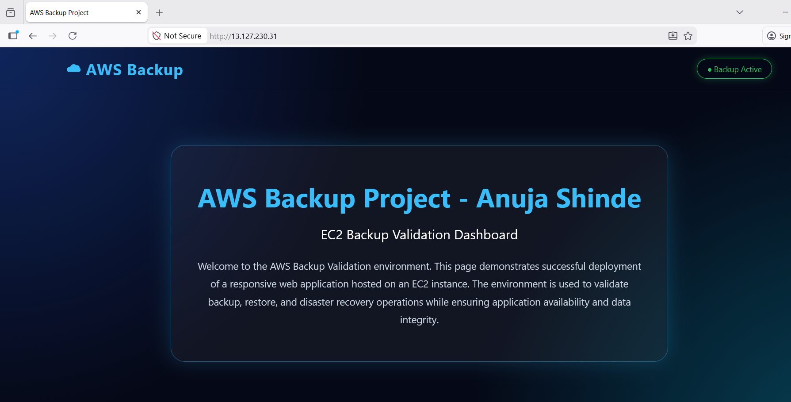
### Step 5: Add Tag to EC2
| Key    | Value |
|-------|-------|
| Backup | Yes   |

---
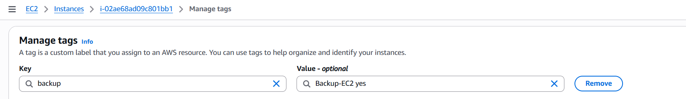
## 🗄️ PART 2: Launch RDS Instance

### Step 6: Create RDS Database
- **Engine:** MySQL  
- **DB Identifier:** backup-db  
- **Username:** admin  
- **Public Access:** Yes  
- **Security Group:** MySQL (3306) – Your IP  

---

### Step 7: Connect to RDS
```bash
mysql -h <RDS-endpoint> -u admin -p
```

---
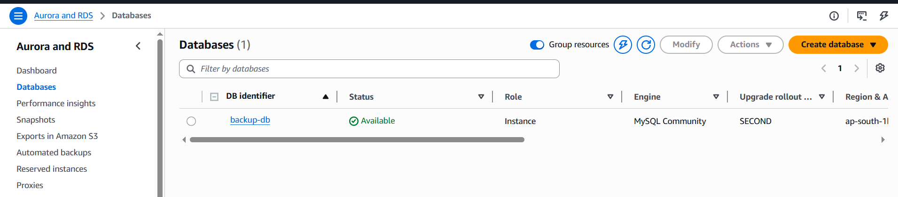
### Step 8: Create Test Database & Data
```sql
CREATE DATABASE backup_test;
USE backup_test;

CREATE TABLE users (
  id INT AUTO_INCREMENT PRIMARY KEY,
  name VARCHAR(100),
  email VARCHAR(100)
);

INSERT INTO users (name, email)
VALUES ('Anuja', 'anujashinde00@gmail.com');

SELECT * FROM users;
```

---
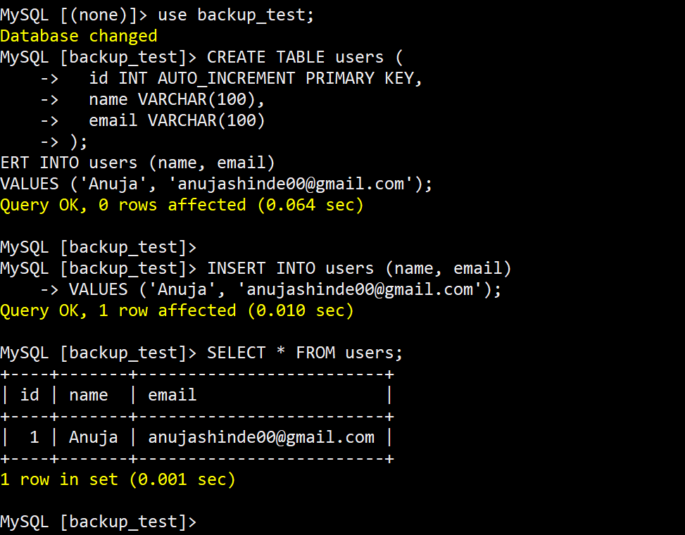
### Step 9: Add Tag to RDS
| Key    | Value |
|-------|-------|
| Backup | Yes   |

---
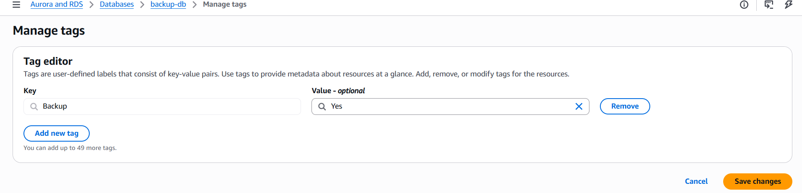
## 🔐 PART 3: AWS Backup Setup

### Step 10: Open AWS Backup
Search **AWS Backup** in AWS Console.

---

### Step 11: Create Backup Vault
- **Vault Name:** MyProjectVault  
- **Encryption:** Default  
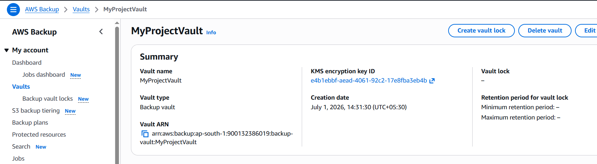
---

### Step 12: Create Backup Plan
- **Plan Name:** EC2-RDS-Backup-Plan  
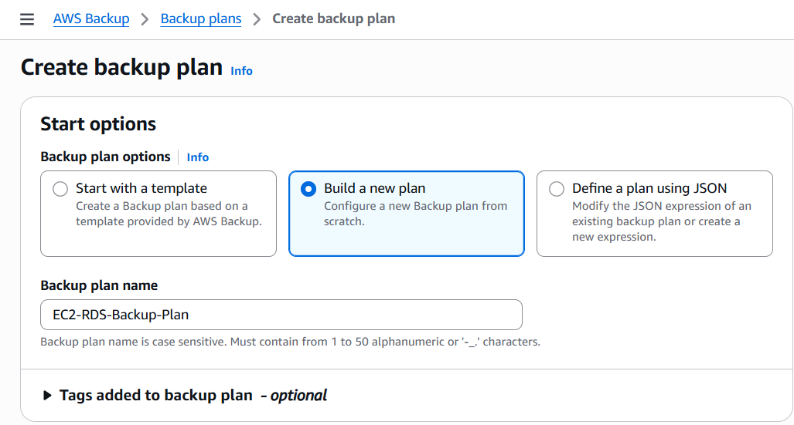
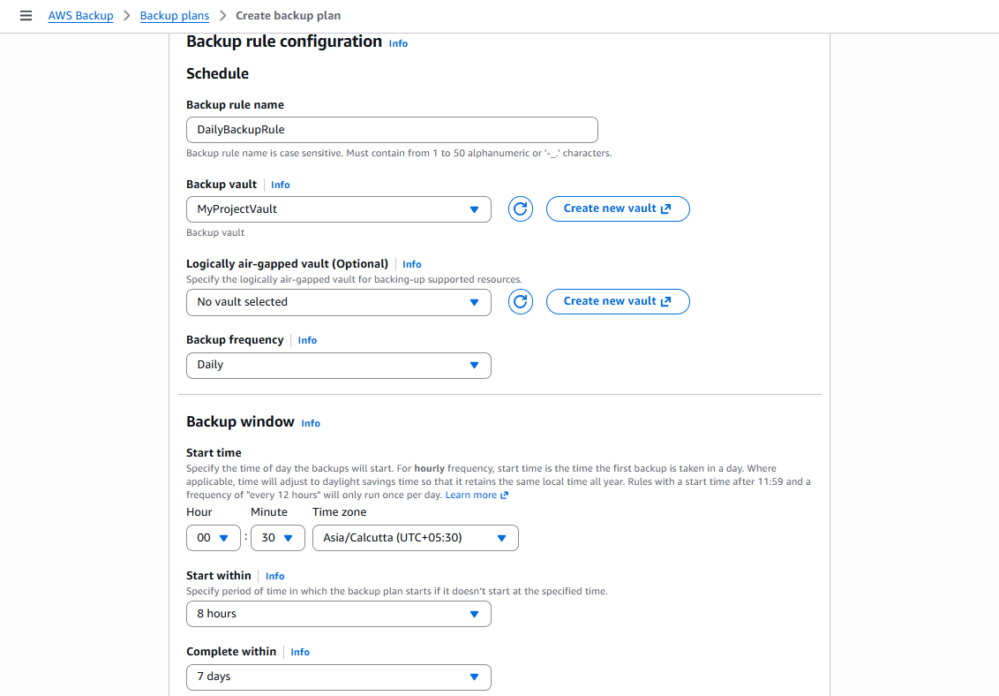
---

### Step 13: Configure Backup Rule
- **Rule Name:** DailyBackupRule  
- **Frequency:** Daily  
- **Retention:** 7 Days  
- **Cold Storage:** After 2 Days (Optional)

---

### Step 14: Assign Resources
- **Assignment Name:** EC2-RDS-Assignment  
- **Method:** Assign by Tags  
- **Tag:** Backup = Yes  

---
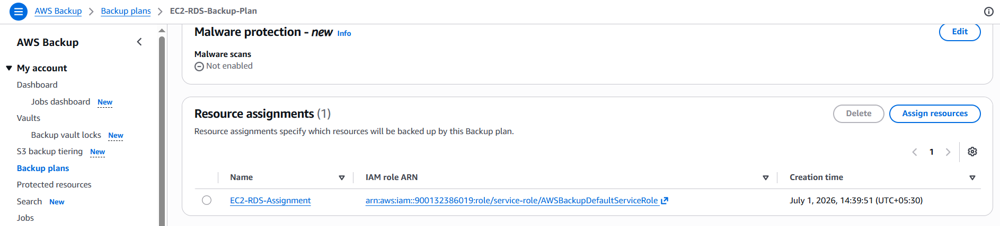
## ▶️ PART 4: On-Demand Backup (Testing)

1. Go to **AWS Backup → Protected Resources**
2. Select EC2 → Create on-demand backup
3. Repeat for RDS

---

## ✅ PART 5: Validation

### Step 16: Verify Backup Jobs
Navigate to:
```
AWS Backup → Backup Jobs
```
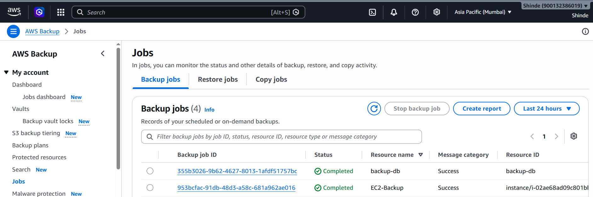
Status should be **Completed**.

---

### Step 17: Verify Recovery Points
Navigate to:
```
AWS Backup → Backup Vaults → MyProjectVault → Recovery Points
```
You should see:
- EC2 Recovery Point
- RDS Recovery Point

---
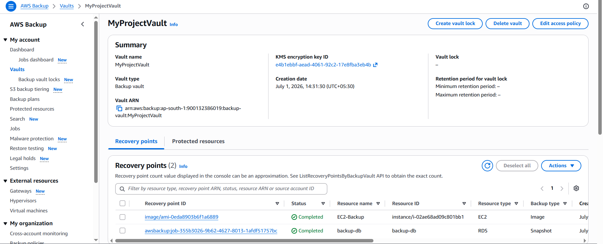
## 🧪 Final Outcome
✔ Automated daily backups  
✔ Tag-based resource selection  
✔ Secure backup vault  
✔ Verified recovery points  

---

## 👨‍💻 Author
**Anuja Shinde**  
AWS Cloud & DevOps
